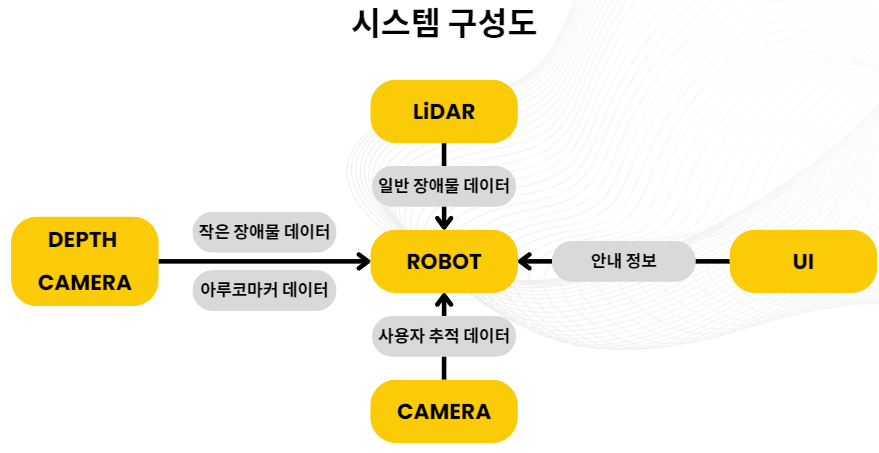

# Dolsoe
[ROS2와 AI를 활용한 자율주행 로봇개발자 부트캠프 단기 심화 2기] (10.28 - 12.27)

주관 : [애드인에듀](https://addinedu.com/), [PinkLAB](https://www.pinklab.art/), [XYZ](https://xyzcorp.io/home)

2차 프로젝트 : [Storagy로봇](https://xyzcorp.io/storagy)을 활용한 자율주행 로봇 서비스 구축

작업 기간 : 11.23 - 12.27

3조 : 손유정(팀장), 김재우, 류재상, 정영훈, 윤성주, 김윤범

## 목차
- [프로젝트 소개](#프로젝트-소개)
- [프로젝트 내 기능](#프로젝트-내-기능)
- [개발 환경](#개발-환경)
- [시스템 구성도](#시스템-구성도)
- [발표자료](#발표자료)

---

## 프로젝트 소개
#### 생활용품점 도우미 봇

제공받은 로봇은 좁은 환경에서 제한된 주행능력이 있었으며, LiDAR센서의 노이즈, LiDAR센서 사각지대의 작은 장애물을 감지할 수 없다는 문제가 있었습니다. 이러한 로봇의 한계 극복을 목표로 이러한 것을 잘 보여줄 수 있는 생활용품점 도우미 봇 컨셉의 서비스를 개발하였습니다. 

## 프로젝트 내 기능
### Youtube

### 로봇 구동의 한계 극복
-  좁은 맵 안전주행
    -  로봇 크기 대비 협소한 환경에서 동작할 수 있는 주행을 목표로 ROS2 Navigation2 패키지의 파라미터 설정을 통해 로봇 크기(0.4m x 0.3m) 대비 좁은 통로(0.65m)를 충돌없이 주행하는데 성공하였습니다. 
- LiDAR 노이즈 제거
    - LiDAR의 산란현상으로 인해 발생하는 노이즈를 장애물로 인식하여 주행가능한 통로임에도 주행할 수 없다고 인식하는 문제가 있어 클러스터링 알고리즘을 통해 노이즈를 제거하였습니다.
- 작은 장애물 감지
    - 지상으로부터 13cm에 위치한 LiDAR 높이 아래의 장애물을 감지할 수 없어 전방의 Depth카메라의 Pointcloud를 사용하여 작은 장애물을 감지하도록 구현하였습니다. 
- 장애물 회피
    - 일시적인 장애물에도 즉각적으로 변경된 경로로 주행하다보니 불필요한 주행거리가 증가하는 문제가 있어 Behavior Tree를 수정하여 장애물로 인해 경로가 재생성되는 경우 일정 시간을 기다려 장애물이 사라지는지 여부를 확인 후 주행하도록 구현하였습니다. 

### 생활용품점 도우미 봇 컨셉
- 모바일 UI
    - 사용자의 편리한 로봇 사용을 위해 로봇 후방의 QR코드로 접속할 수 있는 모바일 웹페이지를 구현하였습니다. 이는 사용자가 찾는 물건을 DB에서 검색하여 로봇에 해당 위치로 이동하라는 명령을 FastAPI와 ROS2를 사용하여 전송합니다.  
-  사용자 등록 및 추적
    - [SAM2](https://github.com/facebookresearch/sam2)를 사용하여 로봇이 사용자를 잃어버리는 경우 정지하고 음성 안내를 하도록 구현하였습니다. 
- 홈스테이션 복귀
    - ROS2의 Navigation2만으로는 정확한 목표지점 도달이 불가하여 아루코 마커를 사용하여 로봇의 자세를 정밀하게 조정하여 지정된 위치로 정밀하게 도착하는 것을 구현하였습니다. 이는 추후 충전스테이션으로 활용될 수 있습니다. 

## 개발 환경
- Ubuntu 22.04
- Python 3.10
- ROS2 humble
- Navigation2
- Sensors
    - Sick tim 571
    - Astra Stereo S U3
    - HD Webcam

## 시스템 구성도

## 발표자료
- [Canva](https://url.kr/exzvup)
- [pdf](./portfolio/presentation.pdf)
